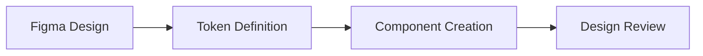
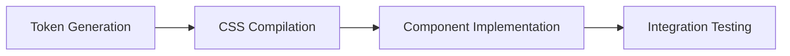
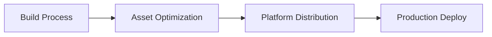

# Chassis Design System - Comprehensive Knowledge Export

*Generated on August 18, 2025*

## 🎯 Executive Summary

Chassis is an enterprise-grade, token-driven design system that bridges the gap between Figma designs and production code across multiple platforms. It features a revolutionary context-aware CSS framework, semantic sizing system, and comprehensive toolchain for modern design-to-development workflows.

## 🏗️ Architecture Overview

### Multi-Repository Structure
Chassis operates as a modular ecosystem with four interconnected repositories:

```
chassis-ecosystem/
├── chassis-tokens/     # Design token generation and management
├── chassis-css/        # Production CSS framework
├── chassis-figma/      # Figma plugins and design tools
└── chassis-docs/       # Documentation website (Astro-based)
```

### Core Philosophy
- **Token-Driven**: Single source of truth for design decisions
- **Context-Aware**: Intelligent component adaptation based on semantic meaning
- **Cross-Platform**: Generate assets for web, iOS, Android, and more
- **Enterprise-Ready**: Scalable, maintainable, production-focused

## 🎨 Design Token System (chassis-tokens)

### Advanced Token Architecture

Chassis implements a sophisticated three-tier token architecture with brand modding system:

#### **Base Tokens** (Brand Level)
- **Brand Identity Tokens**: Brand-specific colors mapped to context roles
  - Primary base color → context primary mapping
  - Accent color → context secondary mapping  
  - Brand-specific corner radiuses, border widths
  - Typography reflecting brand identity
  - Animation and effect timings aligned with brand personality
- **Raw Values**: Contains actual hex codes, pixel values, font names
- **Reference Only**: Not directly used in UI components
- **Brand Differentiation**: Defines what makes each brand unique

#### **Context Tokens** (Application Level)
- **UI-Focused Naming**: References base tokens with application-specific names
- **11 Context Colors**:
  - **primary**: Main brand color for primary actions
  - **secondary**: Accent brand color for secondary actions  
  - **danger**: Error and destructive actions
  - **success**: Positive feedback and confirmations
  - **warning**: Cautions and important notices
  - **info**: Informational content and help
  - **default**: Main application content (dark text on light background)
  - **alternate**: Emphasized/opposite content (light text on dark/primary background)
  - **neutral**: Gray tones for de-emphasized content
  - **black**: Pure black for design needs
  - **white**: Pure white for design needs

- **Rich Color Palettes**: Each context has 30+ color variations:
  ```
  primary.bg-main, primary.bg-subtle, primary.bg-muted
  primary.border-main, primary.border-subtle
  primary.text-main, primary.text-subtle
  primary.surface-1, primary.surface-2, primary.surface-3
  ```

- **Opacity Integration**: Context colors incorporate opacity values for layering
- **Direct UI Usage**: These tokens are used directly in component styles

#### **Granular Tokens** (Component Level)
- **Component-Specific**: Tokens for individual component variations
- **Context References**: Primarily reference context tokens
- **Rare Base References**: Occasionally reference base tokens for specific needs
- **Fine-Tuned Control**: Allow component-level customization without breaking system

### Theme Modding System

#### **Multi-Mode Support**
- **Light/Dark Themes**: Each context color has light and dark mode definitions
- **Runtime Switching**: Seamless theme transitions in applications
- **Design Tool Integration**: Automatic mode generation in Figma

#### **Token Resolution Process**
```
Design Usage: color.context.primary.bg-main
    ↓  color operations (add black or white)
Light Mode: color.base.light.context.primary.bg-main
Dark Mode: color.base.dark.context.primary.bg-main
    ↓  theme set and modding (tokens studio)
Style Dictionary Transformation
    ↓  custom config and transformers 
Platform Output: CSS Custom Properties, SCSS Variables, Swift Code
```

#### **Brand Modding**
- **Multi-Brand Support**: Different brands can have unique base token sets
- **Consistent Context**: Same context structure across all brands
- **Brand Switching**: Runtime brand theme switching capability

### Platform Support
- **Web**: CSS custom properties, SCSS variables, JavaScript objects
- **iOS**: Swift code, .xcassets color sets  
- **Android**: XML resources, Kotlin objects
- **Design**: JSON for Figma Tokens Studio integration

### Token Categories
```yaml
Color System:
  Base Level:
    - Brand primary/secondary color definitions
    - Theme mode variations (light/dark)
    - Raw color values (hex, rgb, hsl)
  
  Context Level:
    - 11 context color families (primary, secondary, danger, success, warning, info, default, alternate, neutral, black, white)
    - 30+ variations per context (bg-main, bg-subtle, text-main, border-subtle, etc.)
    - Opacity-integrated color combinations
  
  Granular Level:
    - Component-specific color overrides
    - Special-case color variations

Spacing System:
  - Semantic sizing (xsmall, small, medium, large, xlarge)
  - Mathematical progression for consistency
  - Context-aware spacing variations

Typography:
  - Brand-specific font families
  - Font weights (100-900)
  - Semantic font sizes aligned with brand hierarchy
  - Line heights and letter spacing optimized per brand

Effects & Animation:
  - Brand-specific border radius values
  - Shadow systems for elevation
  - Animation timing reflecting brand personality
  - Transition durations and easing functions
```

## 🎯 Context System Innovation

### Context-Aware Components
Chassis CSS implements a sophisticated context system with two distinct approaches:

#### **Components with Granular Tokens** (Brand Identity Components)
Operational components that directly reflect brand identity use pre-defined variant tokens:

```css
/* Buttons - use granular variant tokens */
.button.primary { background: var(--cx-color-button-primary-bg-idle); }
.button.secondary { background: var(--cx-color-button-secondary-bg-idle); }

/* Badges - use context variant tokens */
.badge.primary { background: var(--cx-color-context-primary-bg-solid); }
.badge.secondary { background: var(--cx-color-context-secondary-bg-solid); }

/* Form elements - use granular variant tokens */
.form-input.is-valid { border-color: var(--cx-color-form-input-success-border); }
.form-input.is-invalid { border-color: var(--cx-color-form-input-error-border); }
```

These components don't require `.context` classes as their variants are specifically designed with dedicated tokens.

#### **Generic Components with Context Classes**
Generic components without specific token definitions can use `.context` classes to shift to different color palettes:

```css
/* Generic card - uses context switching */
.card { background: var(--cx-default-bg-main); }
.card.context.primary { background: var(--cx-primary-bg-main); }
.card.context.danger { background: var(--cx-danger-bg-main); }

/* Any tag - uses context switching */
.div { background: var(--cx-default-bg-main); }
.div.context.info { background: var(--cx-info-bg-main); }
.div.context.warning { background: var(--cx-warning-bg-main); }
```

### Context Colors
All 11 context colors from the design token system:

- **default**: Main application content (dark text on light backgrounds)
- **alternate**: Emphasized/opposite content (light text on dark/primary backgrounds)
- **primary**: Main brand color for primary actions and emphasis
- **secondary**: Accent brand color for secondary actions  
- **neutral**: De-emphasized gray content for secondary information
- **danger**: Error states and destructive actions
- **success**: Positive feedback and confirmation states
- **warning**: Caution states and important notices
- **info**: Informational content and neutral guidance
- **black**: Pure black for high contrast design needs
- **white**: Pure white for high contrast design needs

### Context Styles (Palette Modifiers)
Context styles modify the entire color palette when applied to components:

```css
/* Basic style (default) */
.card.context.primary { 
  background: var(--cx-primary-bg-main);
  border: var(--cx-primary-border-main);
  color: var(--cx-primary-fg-main);
}

/* Solid style - shifts entire palette */
.card.context.primary.solid { 
  background: var(--cx-primary-bg-solid);
  border: var(--cx-primary-transparent-color);
  color: var(--cx-primary-fg-solid);
}

/* Smooth style - softer palette variation */
.card.context.primary.smooth { 
  background: var(--cx-primary-bg-even);
  border: var(--cx-primary-transparent-color);
  color: var(--cx-primary-fg-main);
}

/* Outline style - transparent with borders */
.card.context.primary.outline { 
  background: var(--cx-primary-transparent-color);
  border: var(--cx-primary-base-color);
  color: var(--cx-primary-base-color);
}
```

#### **Palette Style Types**:
- **basic**: Default balanced appearance (no modifier needed)
- **solid**: Bold, high-contrast appearance with filled backgrounds
- **smooth**: Subtle, softer appearance with muted colors
- **outline**: Transparent backgrounds with prominent borders

### Context Benefits
- **Semantic Flexibility**: Generic components adapt to any context color
- **Brand Consistency**: Specific components maintain brand identity
- **Theme Adaptation**: All contexts automatically adapt across light/dark themes
- **Palette Coherence**: Style modifiers maintain color relationships
- **Developer Experience**: Simple class combinations for complex color systems

## 📐 Semantic Sizing System

### Size Scale
```
xsmall  → Minimal elements (badges, icons)
small   → Compact components (small buttons)
medium  → Standard size (default components)
large   → Prominent elements (hero buttons)
xlarge  → Maximum impact (hero sections)
```

### Application Areas
- **Components**: Buttons, badges, cards, forms
- **Spacing**: Margins, padding, gaps
- **Typography**: Font sizes, line heights
- **Layout**: Grid gaps, container spacing

## 🛠️ CSS Framework (chassis-css)

### Framework Features
- **Utility-First**: Comprehensive utility classes
- **Component-Based**: Pre-built UI components
- **Responsive**: Mobile-first responsive design
- **Customizable**: Theme variables and overrides
- **Performance**: Optimized for production

### Component Library
```
Layout:
  - Grid system (12-column responsive)
  - Container classes
  - Flexbox utilities

Components:
  - Buttons (multiple variants)
  - Cards and surfaces
  - Forms and inputs
  - Navigation elements
  - Notifications and alerts
  - Badges and labels

Utilities:
  - Spacing (margin, padding)
  - Typography (text styling)
  - Colors (text, background)
  - Display and positioning
  - Borders and effects
```

### CSS Custom Properties Integration
- Automatic token-to-CSS conversion
- Theme switching capabilities
- Runtime customization support
- Consistent color relationships

## 🎨 Figma Integration (chassis-figma)

### Figma Plugin Features
- **Token Sync**: Automatic design token synchronization
- **Component Generation**: Create Figma components from tokens
- **Style Management**: Centralized style library
- **Export Tools**: Design-to-code asset generation

### Design Workflow
1. **Design Creation**: Use token-based Figma components
2. **Token Extraction**: Plugin extracts design decisions
3. **Code Generation**: Automatic CSS/component generation
4. **Synchronization**: Keep design and code in sync

### Designer Benefits
- Consistent design language
- Automatic style updates
- Reduced manual work
- Direct connection to development

## 📚 Documentation System (chassis-docs)

### Documentation Architecture
- **Astro Framework**: Static site generation for performance
- **Component Examples**: Live interactive demonstrations
- **API Documentation**: Comprehensive reference guides
- **Integration Guides**: Step-by-step implementation

### Content Structure
```
Getting Started:
  - Quick start guide
  - Installation instructions
  - Basic configuration

Components:
  - Interactive examples
  - Usage guidelines
  - Customization options

Design Tokens:
  - Token reference
  - Platform implementations
  - Custom token creation

Integration:
  - Framework guides (React, Vue, Angular)
  - Build tool configuration
  - Migration strategies
```

## 🚀 Implementation Workflow

### 1. Design Phase


### 2. Development Phase


### 3. Deployment Phase


## 🎯 Target Audience & Use Cases

### Product Leaders
- **Faster Time-to-Market**: 50% reduction in design-to-development time
- **Consistent User Experience**: Unified design language across products
- **Scalable Design Operations**: Systematic approach to design scaling

### Design Leaders
- **Designer-Developer Alignment**: Shared design language and tools
- **Efficient Design Systems**: Centralized component and token management
- **Quality Assurance**: Automated consistency checks

### Development Leaders
- **Reduced Maintenance**: Token-driven styling reduces CSS complexity
- **Accelerated Development**: Pre-built components and utilities
- **Cross-Platform Efficiency**: Single source generating multiple platform assets

## 🏢 Enterprise Benefits

### ROI Metrics
- **50% faster development cycles**
- **90% reduction in design inconsistencies**
- **60% less CSS maintenance overhead**
- **3-month typical implementation timeline**

### Scalability Features
- Multi-brand support with theme switching
- Cross-platform token generation
- Automated design-to-code workflows
- Comprehensive documentation and training

### Technical Benefits
- Type-safe design tokens
- Automatic accessibility compliance
- Performance-optimized output
- Framework-agnostic implementation

## 🛡️ Technical Specifications

### Browser Support
- Modern browsers (Chrome 80+, Firefox 75+, Safari 13+)
- Progressive enhancement for older browsers
- CSS custom property fallbacks

### Framework Compatibility
- **React**: Component library and hooks
- **Vue**: Vue 3 composition API integration
- **Angular**: Service and directive support
- **Vanilla**: Pure CSS and JavaScript usage

### Build Tools
- **Webpack**: Plugin for token integration
- **Vite**: Native support for fast development
- **Parcel**: Zero-config token processing
- **PostCSS**: Plugin ecosystem integration

## 📦 Package Distribution

### NPM Packages
```json
{
  "@chassis/tokens": "Design token definitions",
  "@chassis/css": "Production CSS framework", 
  "@chassis/react": "React component library",
  "@chassis/vue": "Vue component library",
  "@chassis/angular": "Angular component library"
}
```

### CDN Distribution
- Global CDN for CSS framework
- Versioned releases with semantic versioning
- Development and production builds

## 🔧 Configuration & Customization

### Token Customization
```javascript
// Custom token overrides
const customTokens = {
  color: {
    primary: '#your-brand-color',
    secondary: '#your-secondary-color'
  },
  spacing: {
    base: '16px' // Custom base spacing
  }
}
```

### Theme Configuration
```css
:root {
  --chassis-theme: 'custom-brand';
  --cx-primary: #custom-primary;
  --cx-secondary: #custom-secondary;
}
```

## 📈 Adoption Strategy

### Implementation Phases
1. **Pilot Project** (Month 1): Single component migration
2. **Core Components** (Month 2): Essential UI elements
3. **Full Integration** (Month 3): Complete design system adoption
4. **Optimization** (Month 4+): Performance and workflow refinement

### Training & Support
- Comprehensive documentation website
- Interactive examples and tutorials
- Community Discord for support
- Enterprise consultation services

## 🔮 Future Roadmap

### Near-term (6 months)
- Enhanced Figma plugin capabilities
- Additional framework integrations
- Advanced theming features
- Performance optimizations

### Long-term (12+ months)
- AI-powered design suggestions
- Advanced accessibility tooling
- Multi-platform design token evolution
- Enterprise dashboard and analytics

## 📞 Contact & Support

### Community Resources
- **GitHub**: Open source repositories and issue tracking
- **Discord**: Real-time community support
- **Documentation**: Comprehensive guides and examples
- **Blog**: Best practices and case studies

### Enterprise Support
- Professional consultation services
- Custom implementation support
- Training workshops and sessions
- Dedicated support channels

---

## 📄 License & Legal

Chassis Design System is released under the MIT License, making it suitable for both open source and commercial projects. The system is designed to be enterprise-ready while maintaining open source accessibility.

**Copyright 2024 Chassis Design System**
*Building the future of design systems, one token at a time.*

---

*This knowledge export represents the complete understanding of the Chassis Design System based on workspace analysis and architectural documentation. For the most current information, refer to the official documentation at the Chassis website.*
