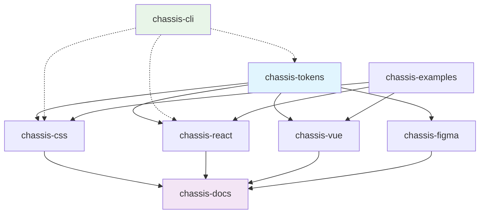

# Ideal Multi-Repo Structure for Chassis Design System

Here's the ideal multi-repo structure for the Chassis Design System in detail:

## **Ideal Multi-Repo Structure**

### **Repository Overview**

```
Chassis Design System Ecosystem
├── chassis-tokens/              # Core design tokens
├── chassis-css/                 # Web CSS framework
├── chassis-react/               # React components (future)
├── chassis-vue/                 # Vue components (future)
├── chassis-figma/               # Figma documentation
├── chassis-docs/                # Documentation website
├── chassis-cli/                 # CLI tools (future)
└── chassis-examples/            # Example implementations
```

---

## **1. chassis-tokens** (Foundation)
*The single source of truth for all design values*

```
chassis-tokens/
├── .github/
│   └── workflows/
│       ├── build.yml            # Build and validate tokens
│       ├── release.yml          # Automated releases
│       └── notify-consumers.yml # Notify dependent repos
├── tokens/
│   ├── global/                  # Platform-agnostic tokens
│   │   ├── colors.json
│   │   ├── spacing.json
│   │   ├── typography.json
│   │   └── borders.json
│   ├── semantic/                # Semantic token mappings
│   │   ├── components.json      # Component-specific tokens
│   │   └── contexts.json        # Context-based tokens
│   └── brands/                  # Brand-specific overrides
│       ├── default.json
│       └── enterprise.json
├── build/
│   ├── build.js                 # Style Dictionary build
│   ├── transforms/              # Custom transforms
│   └── formats/                 # Output formats
├── dist/                        # Generated output
│   ├── web/
│   │   ├── css/                 # CSS custom properties
│   │   ├── scss/                # SCSS variables
│   │   └── js/                  # JavaScript tokens
│   ├── ios/                     # iOS tokens
│   ├── android/                 # Android tokens
│   └── figma/                   # Figma plugin data
├── assets/                      # Design assets
│   ├── fonts/
│   ├── icons/
│   └── images/
├── package.json
├── README.md
└── CHANGELOG.md

# Key Features:
# - Generates tokens for all platforms
# - Webhook notifications to dependent repos
# - Automated releases on token changes
# - Asset management and optimization
```

---

## **2. chassis-css** (Web Framework)
*Token-driven CSS framework for web applications*

```
chassis-css/
├── .github/
│   └── workflows/
│       ├── build.yml            # Build and test
│       ├── visual-regression.yml # Visual testing
│       └── dependency-update.yml # Auto-update chassis-tokens
├── src/
│   ├── core/                    # Core framework
│   │   ├── reset.scss
│   │   ├── tokens.scss          # Import chassis-tokens
│   │   ├── utilities.scss
│   │   └── grid.scss
│   ├── components/              # UI components
│   │   ├── button/
│   │   │   ├── _button.scss
│   │   │   ├── _variants.scss
│   │   │   └── button.test.css
│   │   ├── card/
│   │   ├── modal/
│   │   └── ...
│   ├── contexts/                # Context system
│   │   ├── _primary.scss
│   │   ├── _secondary.scss
│   │   └── _contexts.scss
│   └── themes/                  # Theme variations
│       ├── light.scss
│       └── dark.scss
├── dist/                        # Built CSS
│   ├── chassis.css              # Full framework
│   ├── chassis.min.css          # Minified
│   ├── chassis-core.css         # Core only
│   └── components/              # Individual components
├── tests/                       # Test suites
│   ├── visual/                  # Visual regression
│   ├── unit/                    # Unit tests
│   └── integration/             # Integration tests
├── docs/                        # Component documentation
├── examples/                    # Usage examples
├── tools/                       # Build tools
├── package.json
├── README.md
└── CHANGELOG.md

# Key Features:
# - Consumes chassis-tokens as dependency
# - Individual component exports
# - Visual regression testing
# - Automated token updates
```

---

## **3. chassis-react** (React Components)
*React implementation of Chassis components*

```
chassis-react/
├── .github/
│   └── workflows/
│       ├── build.yml
│       ├── test.yml
│       └── storybook.yml        # Deploy Storybook
├── src/
│   ├── components/              # React components
│   │   ├── Button/
│   │   │   ├── Button.tsx
│   │   │   ├── Button.test.tsx
│   │   │   ├── Button.stories.tsx
│   │   │   └── index.ts
│   │   ├── Card/
│   │   └── ...
│   ├── hooks/                   # Custom hooks
│   ├── utils/                   # Utilities
│   └── types/                   # TypeScript types
├── dist/                        # Built components
├── storybook/                   # Storybook config
├── tests/                       # Test suites
├── package.json
├── README.md
└── CHANGELOG.md

# Key Features:
# - Peer dependency on chassis-css
# - Storybook for component showcase
# - Full TypeScript support
# - Jest + React Testing Library
```

---

## **4. chassis-figma** (Design Documentation)
*Figma component documentation and design assets*

```
chassis-figma/
├── .github/
│   └── workflows/
│       ├── sync-figma.yml       # Sync with Figma API
│       └── validate-docs.yml    # Validate documentation
├── docs/                        # Component documentation
│   ├── components/
│   │   ├── button/
│   │   │   ├── anatomy.md
│   │   │   ├── variants.md
│   │   │   ├── specs.md
│   │   │   ├── tokens.md
│   │   │   └── guidelines.md
│   │   └── ...
│   ├── patterns/                # Design patterns
│   ├── guidelines/              # Design guidelines
│   └── tokens/                  # Token documentation
├── assets/                      # Figma exports
│   ├── components/              # Component screenshots
│   ├── patterns/                # Pattern examples
│   └── specs/                   # Design specifications
├── figma/                       # Figma integration
│   ├── connect/                 # Figma Connect codes
│   ├── plugins/                 # Figma plugins
│   └── libraries/               # Component libraries
├── tools/                       # Automation tools
│   ├── figma-sync.js           # Sync with Figma API
│   └── asset-export.js         # Export assets
├── package.json
├── README.md
└── CHANGELOG.md

# Key Features:
# - Automated Figma API sync
# - Component documentation
# - Asset export automation
# - Design specification tracking
```

---

## **5. chassis-docs** (Documentation Website)
*Central documentation and showcase website*

```
chassis-docs/
├── .github/
│   └── workflows/
│       ├── deploy.yml           # Deploy to Vercel/Netlify
│       ├── sync-submodules.yml  # Update dependencies
│       └── lighthouse.yml       # Performance testing
├── apps/
│   └── website/                 # Astro documentation site
│       ├── src/
│       │   ├── pages/
│       │   ├── components/
│       │   ├── layouts/
│       │   └── content/         # MDX content
│       ├── public/
│       └── astro.config.mjs
├── vendor/                      # Git submodules
│   ├── chassis-tokens/          # → chassis-tokens repo
│   ├── chassis-css/             # → chassis-css repo
│   ├── chassis-react/           # → chassis-react repo
│   └── chassis-figma/           # → chassis-figma repo
├── scripts/                     # Automation scripts
│   ├── sync-all.js             # Sync all submodules
│   ├── build-examples.js       # Build example pages
│   └── deploy.js               # Deploy coordination
├── examples/                    # Live examples
│   ├── react-app/              # React example
│   ├── vue-app/                # Vue example
│   └── vanilla-html/           # HTML/CSS example
├── tools/                       # Build tools
├── package.json
├── README.md
└── CHANGELOG.md

# Key Features:
# - Aggregates all Chassis repositories
# - Live examples and demos
# - Automated submodule updates
# - Performance monitoring
```

---

## **6. chassis-cli** (Developer Tools)
*Command-line tools for Chassis development*

```
chassis-cli/
├── src/
│   ├── commands/
│   │   ├── init.js             # Initialize new project
│   │   ├── sync.js             # Sync dependencies
│   │   ├── build.js            # Build project
│   │   └── validate.js         # Validate tokens/components
│   ├── templates/              # Project templates
│   └── utils/
├── bin/
│   └── chassis                 # CLI executable
├── package.json
├── README.md
└── CHANGELOG.md

# Key Features:
# - Project scaffolding
# - Dependency management
# - Validation tools
# - Template generation
```

---

## **Repository Relationships & Dependencies**



---

## **Cross-Repository Coordination**

### **1. Dependency Management**
```json
// chassis-css/package.json
{
  "dependencies": {
    "@chassis/tokens": "^1.0.0"
  },
  "peerDependencies": {
    "@chassis/tokens": "^1.0.0"
  }
}
```

### **2. Automated Updates**
```yaml
# .github/workflows/dependency-update.yml
name: Update Dependencies
on:
  repository_dispatch:
    types: [chassis-tokens-updated]
jobs:
  update:
    runs-on: ubuntu-latest
    steps:
      - name: Update chassis-tokens
        run: npm update @chassis/tokens
```

### **3. Release Coordination**
```bash
# scripts/coordinated-release.sh
#!/bin/bash
# 1. Release tokens
# 2. Update and release CSS
# 3. Update and release React
# 4. Update documentation
# 5. Create coordinated release notes
```

### **4. Cross-Repo Communication**
```javascript
// Webhook handler for token updates
const notifyConsumers = async (tokenChanges) => {
  const repos = ['chassis-css', 'chassis-react', 'chassis-vue'];
  
  for (const repo of repos) {
    await github.repos.createDispatchEvent({
      owner: 'chassis',
      repo: repo,
      event_type: 'chassis-tokens-updated',
      client_payload: { changes: tokenChanges }
    });
  }
};
```

---

## **Benefits of This Structure**

1. **Clear Separation**: Each repo has a single responsibility
2. **Independent Development**: Teams can work autonomously
3. **Flexible Consumption**: Projects can choose what to include
4. **Scalable**: Easy to add new platforms/frameworks
5. **Maintainable**: Smaller codebases are easier to manage
6. **Version Control**: Independent versioning and release cycles

This structure provides the foundation for a robust, scalable design system that can grow with your organization's needs while maintaining clear boundaries and responsibilities.